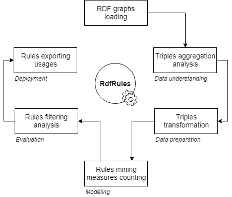
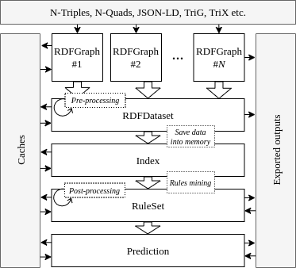

# RdfRules

RdfRules is a fast analytics engine for rule mining in RDF knowledge graphs. It offers tools for complex rule mining process including RDF data pre-processing and rules post-processing. The core of RdfRules is written in the Scala language. Besides the Scala API,
RdfRules also provides a Java API, REST web service and a graphical user interface via a web browser. RdfRules uses the [AMIE+](https://www.mpi-inf.mpg.de/departments/databases-and-information-systems/research/yago-naga/amie/) algorithm with several extensions as a basis for a complete solution for linked data mining.

## Getting started

RdfRules is divided into four main modules. They are:
 - Scala API: It is sutable for Scala programmers and for use RdfRules as a framework to invoke mining processes from Scala code.
 - Java API: Similar to Scala API but adapted for Java programmers.
 - Web Service: It is suitable for modular web-based applications and remote access via HTTP.
 - GUI: It is suitable for anyone who wants to use the tool quickly and easily without any needs for further programming.
 
 Detailed information about these modules with deployment instructions are described in their subfolders...
 
 ## Design and Architecture
 

 
The architecture of the RdfRules core is composed of four main data abstractions: RdfGraph, RdfDataset, Index and RuleSet. These objects are gradually created during processing of RDF data and rule mining. Each object consists of several operations which either *transform* the current object or perform some *action* to create an output. Hence, these operations are classied as transformations or actions.



### Transformations
Any transformation is a lazy operation that converts the current data object to another. For example a transformation in the RdfDataset
object creates either a new RdfDataset or an Index object.

### Actions

An action operation applies all pre-dened transformations on the current and previous objects, and processes (transformed) input data to create a desired output such as rules, histograms, triples, statistics etc. Compared to transformations, actions may load data into memory and perform time-consuming operations.

### Caching

If we use several action operations, e.g. with various input parameters, over the same data and a set of transformations, then all the defined transformations are performed repeatedly for each action. This is caused by lazy behavior of main data objects and the streaming process lacking memory of previous steps. These redundant and repeating calculations can be eliminated by
caching of performed transformations. Each data object has the cache method that can perform all defined transformations immediately and store the result either into memory or on a disk.

## Main Abstractions

### RdfGraph

The *RdfGraph* object is a container for RDF triples and is built once we load an RDF graph. It can either be a file or a stream of triples or quads in a standard RDF format such as N-Triples, N-Quads, JSON-LD, TriG or TriX. If the input format contains a set of quads (with information about named graphs) all triples are merged to one graph. Alternatively, we can create directly the *RdfDataset* object (see below) from quads and to preserve the distribution of triples in the individual graphs. This object has defined following main operations:

#### Transformations

Operation | Description
------------ | -------------
map(*func*) | Return a new *RdfGraph* object with mapped triples by a function *func*.
filter(*func*) | Return a new *RdfGraph* object with filtered triples by a function *func*.
take(*n*), drop(*n*), slice(*from*, *until*) | Return a new *RdfGraph* object with filtered triples by cutting the triple set.
discretize(*task*, *func*) | Return a new *RdfGraph* object with discretized numeric literals by a predefined *task*. It processes such triples which satisfy a function *func*.

#### Actions

Operation | Description
------------ | -------------
foreach(*func*) | Apply a function *func* for each triple.
histogram(*s*, *p*, *o*) | Return a map where keys are items and values are numbers of aggregated items. Parameters *s*, *p*, *o* represents booleans determining which triple items should be aggregated.
types() | Return a list of all predicates with their type ranges and frequencies.
cache(*target*) | Cache this *RdfGraph* object either into memory or into a file on a disk.
export(*target*, *format*) | Export this *RdfGraph* object into a file in some familiar RDF format.

### RdfDataset

The *RdfDataset* object is a container for RDF quads and is created from one or many *RdfGraph* instances. This data object has the same operations as the *RdfGraph*. The only difference is that operations do not work with triples but with quads.

#### Transformations

Operation | Description
------------ | -------------
map(*func*) | Return a new *RdfDataset* object with mapped quads by a function *func*.
filter(*func*) | Return a new *RdfDataset* object with filtered quads by a function *func*.
take(*n*), drop(*n*), slice(*from*, *until*) | Return a new *RdfDataset* object with filtered quads by cutting the quad set.
discretize(*task*, *func*) | Return a new *RdfDataset* object with discretized numeric literals by a predefined *task*. It processes such quads which satisfy a function *func*.
addGraph(*graph*) | Return a new *RdfDataset* with added *graph*.
index(*mode*) | Create an *Index* object from this *RdfDataset* object.

#### Actions

Operation | Description
------------ | -------------
foreach(*func*) | Apply a function *func* for each quad.
histogram(*s*, *p*, *o*) | Return a map where keys are items and values are numbers of aggregated items. Parameters *s*, *p*, *o* represents booleans determining which triple items should be aggregated.
types() | Return a list of all predicates with their type ranges and frequencies.
cache(*target*) | Cache this *RdfDataset* object either into memory or into a file on a disk.
export(*target*, *format*) | Export this *RdfDataset* object into a file in some familiar RDF format.

### Index

The *Index* object can be created from the *RdfDataset* object or loaded from cache. It contains prepared and indexed data in memory and has operations for rule mining with the AMIE+ algorithm.

#### Transformations

Operation | Description
------------ | -------------
toDataset() | Return a *RdfDataset* object from this *Index* object.

#### Actions

Operation | Description
------------ | -------------
cache(*target*) | Serialize this *Index* object into a file on a disk.
mine(*task*) | Execute a rule mining *task* with thresholds, constraints and patterns, and return a *RuleSet* object.

### RuleSet

The *RuleSet* object is on the output of the RdfRules workflow. It contains all discovered rules conforming to all input restrictions. This final object has multiple operations for rule analysis, counting additional measures of significance, rule filtering and sorting, rule clustering, and finally rule exporting for use in other systems.

#### Transformations

Operation | Description
------------ | -------------
map(*func*) | Return a new *RuleSet* object with mapped rules by a function *func*.  
filter(*func*) | Return a new *RuleSet* object with filtered rules by a function *func*.  
take(*n*), drop(*n*), slice(*from*, *until*) | Return a new *RuleSet* object with filtered rules by cutting the rule set.  
filterByPatterns (*patterns*) | Return a new *RuleSet* object with rules matching at least one of the input rule patterns. 
sortBy(*measures*) | Return a new *RuleSet* object with sorted rules by selected measures of significance.  
computeConfidence (*minConf*) | Return a new *RuleSet* object with the computed confidence measure for each rule that must be higher than the *minConf* value.  
computePcaConfidence (*minPcaConf*) | Return a new *RuleSet* object with the computed PCA confidence measure for each rule that must be higher than the *minPcaConf* value.  
computeLift(*minConf*) | Return a new *RuleSet* object with the computed lift measure for each rule.  
makeClusters(*task*) | Return a new *RuleSet* object with clusters computed by a clustering task.   
findSimilar(*rule*, *n*), findDissimilar(*rule*, *n*) | Return a new *RuleSet* object with top *n* rules, the selected rules will be the most similar (or dissimilar) ones from the input rule.

#### Actions

Operation | Description
------------ | -------------
foreach(*func*) | Apply a function *func* for each rule.  
cache(*target*) | Cache this *RuleSet* object either into memory or into a file on a disk.  
export(*target*, *format*) | Export this *RuleSet* object into a file in some selected output format.  

## Pre-processing

You can use *RdfGraph* and *RdfDataset* abstractions to analyze and pre-process input RDF data before the mining phase. First you load RDF datasets into the RdfRules system and then you can aggregate data, count occurences or read types of individual triple items. Based on the previous analysis you can define some transformations including triples/quads merging, filtering or replacing. Transformed data can either be saved on a disk into a file in some RDF format or the binary format for later use, or used for indexing and rule mining. Therefore, RdfRules is also suitable for RDF data transformations and is not intended only for rules mining.

RdfRules uses the [EasyMiner-Discretization](https://github.com/KIZI/EasyMiner-Discretization) module which provides some implemented unsupervised discretization algorithms, such as equal-frequency and equal-width. These algorithms can be easily used within the RdfRules tool where they are adapted to work with RDF triple items.

## Indexing

Before mining the input dataset has to be indexed into memory for the fast rules enumeration and measures counting. The AMIE+ algorithm uses six fact indexes that hold data in several hash tables. Hence, it is important to realize that the complete input data are replicated six times and then stored into memory before the mining phase. This index may have two modes: *preserved* and *in-use*. The *preserved* mode keeps data in memory until the existence of the index object, whereas the *in-use* mode loads data into memory only if the index is needed and is released after use.

Data are actually stored in memory once the mining process is started. The system automatically resolves all triples with the *owl:sameAs* predicate and replaces all objects by their subjects in these kinds of triples. Thanks to this functionality we can mine across several graphs and link statements by the *owl:sameAs* predicate.

## Rule Mining

RdfRules uses the [AMIE+](https://www.mpi-inf.mpg.de/departments/databases-and-information-systems/research/yago-naga/amie/) algorithm as the background for rule mining. It mines logical rules in the form of Horn clause with one atom at the head position and with conjunction of atoms at the body position. An atom is a statement (or triple) which is further indivisible and contains a fixed constant at the predicate position and variables or constants at the subject and/or object position, e.g., the atom *livesIn(a, b)* contains variables *a* and *b*, whereas the atom *livesIn(a, Prague)* contains only one variable *a* and the fixed constant *Prague* at the object position.

```
Horn rules samples:
1: livesIn(a, b) => wasBornIn(a, b)
2: livesIn(a, Prague) => wasBornIn(a, Prague)
3: isMarriedTo(a, b) ^ directed(b, c) => actedIn(a, c)
4: hasChild(a,c) ^ hasChild(b,c) => isMarriedTo(a,b)
```

The output rule has to fulfill several conditions. First, rule atoms must be *connected* and mutually reachable. That means variables are shared among atoms to form a continuous path. Second, there are allowed only *closed* rules. A rule is *closed* if its atoms involves any variable and each variable appears at least twice in the rule. Finally, atoms must not be reflexive - one atom does not contain two same variables.

There are four parameters that are passing to the rule mining process. They are: indexed data, thresholds, rule patterns and constraints. The relevance of rules is determined by their measures of significance. In RdfRules we use all measures defined in AMIE+ and some new measures such as lift or clusters.

### Measures of Significance

Measure | Description
------------ | -------------
HeadSize | The *head size* of a rule is a measure which indicates a number of triples (or instances) conforming the head of the rule.  
Support | From all triples matching the head of the rule we count a subset from which we are able to build a path conforming the body of a the rule. With the increasing rule-length the support value is decreasing or unchanged and is always lower or equal to the head size.
HeadCoverage | This is the relative value of the support measure depending on the head size. ```HC = Support / HeadSize```
BodySize | The *body size* is a number of all possible paths in an RDF knowledge graph that conform the body of the rule.
Confidence | The *standard confidence* is a measure compares the body size to the support value and is interpreted as a probability of the head occurrence given the specific body.
PcaConfidence | This kind of confidence measure is more appropriate for OWA, since a missing fact for a subject variable in the head is not assumed to be a counter-example.
PcaBodySize | Counted *body size* from which the *PCA confidence* is computed.
HeadConfidence | Probability of the head occurrence by a random choice across the overall dataset.
Lift | The ratio between the *standard confidence* and the *head confidence*. With this measure we are able to discover a dependency between the head and the body of the rule.
Cluster | We can make rule clusters by their similarities. This measure only specifies a number of cluster to which the rule belongs.

### Thresholds

There are several main pruning thresholds which influence the speed of the rules enumeration process:

Threshold | Description
------------ | -------------
MinHeadSize | A minimum number of triples matching the rule head. It must be greater than *zero*.  
MinHeadCoverage | A minimal head coverage. It must be greater than *zero* and less than or equal to *one*.   
MaxRuleLength | A maximal length of a rule. It must be greater than *one*.   
TopK | A maximum number of returned rules sorted by head coverage. It must be greater than *zero*.  
Timeout | A maximum mining time in minutes.

### Rule Patterns

All mined rules must match at least one pattern defined in the rule patterns list. If we have an idea of what atoms mined rules should contain, we can define one or several rule patterns. A rule pattern is either *exact* or *partial*. The number of atoms in any mined rule must be less than or equal to the length of the *exact* rule pattern. For a *partial* mode, if some rule matches the whole pattern then all its extensions also match the pattern.

```
AtomItemPattern:
 Any               // Any item
 AnyVar,           // Any variable
 AnyConst,         // Any constant
 Var(x)            // An item must be variable x
 Consts(x)         // An item must be constant x
 OneOf(x[])        // An item must match at least one of the pre-defined atom item patterns x 
 NoneOf(x[])       // An item must not match all of the pre-defined atom item patterns x

AtomPattern(
 subject: AtomItemPattern,       // A pattern for subject, default is Any
 predicate: AtomItemPattern,     // A pattern for predicate, default is Any
 object: AtomItemPattern,        // A pattern for object, default is Any 
 graph: AtomItemPattern          // A pattern for graph, default is Any
)

RulePattern(
 body: AtomPattern[]             // Patterns for the body of the rule
 head: AtomPattern               // A pattern for the head of the rule
)
```

### Constraints

Finally, the last mining parameter specifies additional constraints and defines a way of mining. Here is a list of implemented constraints that can be used:

Constraint | Description
------------ | -------------
OnlyPredicates(*x*) | Rules must contain only predicates defined in the set *x*.
WithoutPredicates(*x*) | Rules must not contain predicates defined in the set *x*.
WithInstances | It allows to mine rules with constants at the subject or object position.
WithObjectInstances | It allows to mine rules with constants only at the object position.
WithoutDuplicitPredicates | Disable to mine rules which contain some predicate in more than one atom.

## Post-processing

During the mining process the RdfRules count only basic measures of significance: head size, support and head coverage. If you want to compute other measures (like confidences and lift) you can do it explicitly in the post-processing phase. The RdfRules tool also supports rules clustering by the DBScan algorithm. It uses pre-defined similarity functions comparing rule contents and computed measures of significance. We can also use similarity counting to determine top-*k* most similar or dissimilar rules to a selected rule.

All mined rules can also be filtered or sorted by used-defined functions and finally exported either into a human-readable text format or into a machine-readable JSON format.

```
Example of the TEXT output format:
(?a <participatedIn> <Turbot_War>) ^ (?a <imports> ?b) -> (?a <exports> ?b) | support: 14, headCoverage: 0.037, confidence: 0.636, pcaConfidence: 0.636, lift: 100.41, headConfidence: 0.0063, headSize: 371, bodySize: 22, pcaBodySize: 22, cluster: 7
```

```json
//Example of the JSON output format:
[{
  "head": {
    "subject": {
      "type": "variable",
      "value": "?a"
    },
    "predicate": "<exports>",
    "object": {
      "type": "variable",
      "value": "?b"
    }
  },
  "body": [{
    "subject": {
      "type": "variable",
      "value": "?a"
    },
    "predicate": "<participatedIn>",
    "object": {
      "type": "constant",
      "value": "<Turbot_War>"
    }
  }, {
    "subject": {
      "type": "variable",
      "value": "?a"
    },
    "predicate": "<imports>",
    "object": {
      "type": "variable",
      "value": "?b"
    }
  }],
  "measures": [{
    "name": "headSize",
    "value": 371
  }, {
    "name": "confidence",
    "value": 0.6363636363636364
  }, {
    "name": "support",
    "value": 14
  }, {
    "name": "bodySize",
    "value": 22
  }, {
    "name": "headConfidence",
    "value": 0.006337397533925742
  }, {
    "name": "pcaConfidence",
    "value": 0.6363636363636364
  }, {
    "name": "lift",
    "value": 100.41403162055336
  }, {
    "name": "pcaBodySize",
    "value": 22
  }, {
    "name": "headCoverage",
    "value": 0.03773584905660377
  }, {
    "name": "cluster",
    "value": 7
  }]
}]
```

In RdfRules we can also attach information about graph at every atom and then filter rules based on named graphs. This ability is useful to discover new knowledge based on linking multiple graphs.

```
(?a <hasChild> ?c <yago>) ^ (?c <dbo:parent> ?b <dbpedia>) -> (?a <isMarriedTo> ?b <yago>)
```

## Licence

RdfRules is licensed under [GNU General Public License v3.0](http://www.gnu.org/licenses/gpl-3.0.txt)
