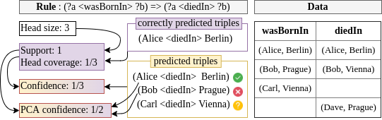

# RDFRules

RDFRules is a powerful analytical tool for rule mining from RDF knowledge graphs. It offers a complex rule mining solution including RDF data pre-processing, rules post-processing and prediction abilities from rules. The core of RDFRules is written in the Scala language. Besides the Scala API, RDFRules also provides REST web service with graphical user interface via a web browser. RDFRules uses the [AMIE](https://www.mpi-inf.mpg.de/departments/databases-and-information-systems/research/yago-naga/amie/) algorithm with several extensions as a basis for a complete rule mining solution.

LIVE DEMO: [https://br-dev.lmcloud.vse.cz/rdfrules/](https://br-dev.lmcloud.vse.cz/rdfrules/)

## Getting started

Requirements: Java 11+

RDFRules is divided into five main modules. They are:
 - [Scala API](core): It is sutable for Scala programmers and for use RDFRules as a framework to invoke mining processes from Scala code.
 - [Web Service or Batch Processing](http): It is suitable for modular web-based applications and remote access via HTTP. Individual tasks can be also started in batch processing mode without any user interactions.
 - [GUI](gui): It is suitable for anyone who wants to use the tool quickly and easily without any needs for further programming.
 - [Experiments](experiments): This module contains some examples using Scala API. There is also a script for the complex benchmark comparing RDFRules with the original AMIE implementation using several threads and mining modes. Some results of performed experiments are placed in the [results](experiments/results) folder.
 
 Detailed information about these modules with deployment instructions are described in their subfolders.
 
 ### Quick and easy run of RDFRules
 
 1. Download the latest [release](https://github.com/propi/rdfrules/releases) in the .zip format (currently v1.7.2) and unpack it into a folder.
 2. Go to the unpacked RDFRules home folder (with /bin, /webapp and /lib folders) and run RDFRules HTTP API (compiled under Java 11)
    - On Linux: ```sh bin/main```
    - On Windows: ```.\bin\main.bat```
 3. Open GUI via ```http://localhost:8851/``` or ```./webapp/index.html``` in a modern Internet browser.

#### Batch processing

If you need to run an RDFRules task as a scheduled job then define a json task (read more about task definitions in the [http](http) submodule). We recommend to use the GUI to construct a task. Save your task to a file and run the process by following command:
- On Linux: ```sh bin/main task.json```
- On Windows: ```.\bin\main.bat task.json```

A result in the json format is printed into stdout with other logs. If you need to export the json result into a separated file without logs, define a second argument as a file target path.
- On Linux: ```sh bin/main task.json result.json```
- On Windows: ```.\bin\main.bat task.json result.json```

#### Compile executable files from source code

RDFRules is written in Scala 2.13, therefore you need to first install [SBT](https://www.scala-sbt.org/) - interactive build tool for Scala. Then clone this repository and go to the root `./rdfrules` folder. If you want to pack HTTP module to executable files, run the following sbt command in the root folder:

```
sbt> project http
sbt> pack
```

If you want to compile the GUI source files, input following commands:

```
sbt> project gui
sbt> fullOptJS
```

The compiled javascript file needed for GUI is placed in `gui/target/scala-2.13/gui-opt/main.js`. You need to edit `gui/webapp/index.html` where the right path to the compiled main javascript file and the HTTP API URL should be set. Then you can use `gui/webapp/index.html` in your favorite internet browser to open the RDFRules GUI.

 ## Design and Architecture
 

 
The architecture of the RDFRules core is composed of five main data abstractions: RDFGraph, RDFDataset, Index, Ruleset and Prediction. These objects are gradually created during processing of RDF data and rule mining. Each object consists of several operations which either *transform* the current object or perform some *action* to create an output. Hence, these operations are classied as transformations or actions.


### Transformations
Any transformation is a lazy operation that converts the current data object to another. For example a transformation in the RDFDataset
object creates either a new RDFDataset or an Index object.

### Actions

An action operation applies all pre-defined transformations on the current and previous objects, and processes (transformed) input data to create a desired output such as rules, histograms, triples, statistics etc. Compared to transformations, actions may load data into memory and perform time-consuming operations.

### Caching

If we use several action operations, e.g. with various input parameters, over the same data and a set of transformations, then all the defined transformations are performed repeatedly for each action. This is caused by lazy behavior of main data objects and the streaming process lacking memory of previous steps. These redundant and repeating calculations can be eliminated by
caching of performed transformations. Each data object has the cache method that can perform all defined transformations immediately and store the result either into memory or on a disk.

## Main Abstractions

### RDFGraph

The *RDFGraph* object is a container for RDF triples and is built once we load an RDF graph. It can either be a file or a stream of triples or quads in a standard RDF format such as N-Triples, N-Quads, JSON-LD, TriG or TriX. If the input format contains a set of quads (with information about named graphs) all triples are merged to one graph. Alternatively, we can create directly the *RDFDataset* object (see below) from quads and to preserve the distribution of triples in the individual graphs. This object has defined following main operations:

#### Transformations

| Operation  | Description                                                                                           |
|------------|-------------------------------------------------------------------------------------------------------|
| map quads  | Return a new *RDFGraph* object with updated triples.                                                  |
| filter     | Return a new *RDFGraph* object with filtered triples.                                                 |
| shrink     | Return a new shrinked *RDFGraph* object.                                                              |
| split      | Split the loaded KG into several parts with sampling.                                                 |
| discretize | Return a new *RDFGraph* object with discretized numeric literals by a predefined *task* and *filter*. |
| merge      | Merge all loaded graphs into one RDFDataset.                                                          |

#### Actions

| Operation  | Description                                                |
|------------|------------------------------------------------------------|
| get        | Get and show all triples.                                  |
| histogram  | Return histogram by chosen aggregated triple items.        |
| properties | Return informations and stats about all properties.        |
| export     | Export this graph into a file in some familiar RDF format. |

### RDFDataset

The *RDFDataset* object is a container for RDF quads and is created from one or many *RDFGraph* instances. This data object has the same operations as the *RDFGraph*. The only difference is that operations do not work with triples but with quads.

#### Transformations (different from RDFGraph)

| Operation | Description                                                  |
|-----------|--------------------------------------------------------------|
| index     | Create an fact *Index* object from this *RDFDataset* object. |

### Index

The *Index* object can be created from the *RDFDataset* object or loaded from a cache. It contains prepared and indexed data in memory and has operations for rule mining with the RDFRules algorithm.

#### Transformations

| Operation | Description                                                                                            |
|-----------|--------------------------------------------------------------------------------------------------------|
| mine      | Execute a rule mining *task* with thresholds, constraints and patterns, and return a *Ruleset* object. |

#### Actions

| Operation              | Description                                                               |
|------------------------|---------------------------------------------------------------------------|
| properties cardinality | Get cardinalities from selected properties (such as size, domain, range). |
| export                 | Serialize and export loaded index into a file for a later use.            |


### Ruleset

The *Ruleset* object is on the output of the RDFRules workflow. It contains all discovered rules conforming to all input restrictions. This final object has multiple operations for rule analysis, counting additional measures of significance, rule filtering and sorting, rule clustering, prediction from rules, and finally rule exporting for use in other systems.

#### Transformations

| Operation          | Description                                                                                                            |
|--------------------|------------------------------------------------------------------------------------------------------------------------|
| filter             | Return a new *Ruleset* object with filtered rules by measures of significance or rule patterns.                        |
| shrink             | Return a new shrinked *Ruleset* object.                                                                                |
| sort               | Return a new *Ruleset* object with sorted rules by selected measures of significance.                                  |
| compute confidence | Return a new *Ruleset* object with the computed confidence measure (CWA or PCA) for each rule by a selected threshold. |
| make clusters      | Return a new *Ruleset* object with clusters computed by a clustering task.                                             |
| prune              | Return a new *Ruleset* object reduced by a selected pruning strategy.                                                  |
| predict            | Use all rules in the *Ruleset* for new triples prediction. This operation returns a *Prediction* object.               |

#### Actions

| Operation    | Description                                                              |
|--------------|--------------------------------------------------------------------------|
| get and show | Get and show all mined rules.                                            |
| export       | Export this *Ruleset* object into a file in some selected output format. |

### Prediction

The *Prediction* object is a container of all predicted triples by a ruleset. It differs positive, negative or PCA positive types of prediction. Each predicted triple has information about all rules which predict that triple.

#### Transformations

| Operation           | Description                                                                                                                                    |
|---------------------|------------------------------------------------------------------------------------------------------------------------------------------------|
| filter              | Return a new *Prediction* object with filtered predicted triples by measures of significance, rule patterns, triple filters and other options. |
| shrink              | Return a new shrinked *Prediction* object.                                                                                                     |
| sort                | Return a new *Prediction* object with sorted predicted triples by their rules and their measures of significance.                              |
| group               | Aggregate and score triples predicted by many rules.                                                                                           |
| to prediction tasks | Generate prediction tasks by a user-defined strategy.                                                                                          |
| to dataset          | Transform all predicted triples into the *RDFGraph* object                                                                                     |

#### Actions

| Operation    | Description                                                                                                                                                                     |
|--------------|---------------------------------------------------------------------------------------------------------------------------------------------------------------------------------|
| get and show | Get and show predicted triples with bound rules.                                                                                                                                |
| export       | Export this *Prediction* object into a file in some selected output format.                                                                                                     |

### PredictionTasks

The *PredictionTasks* object is a special container of all predicted triples divided into generated prediction tasks. Each prediction task (e.g. `<Alice> <wasBornIn> ?`) has a list of sorted candidates by their score. This structure allows to select candidates by a chosen selection strategy, and construct a dataset from predicted candidates. 

#### Transformations

| Operation         | Description                                                           |
|-------------------|-----------------------------------------------------------------------|
| filter            | Return a new *PredictionTasks* object with filtered prediction tasks. |
| shrink            | Return a new shrinked *PredictionTasks* object.                       |
| select candidates | Select candidates from each prediction task by a selection strategy.  |
| to prediction     | Convert this object back to the *Prediction* object.                  |
| to dataset        | Transform all predicted triples into the *RDFGraph* object            |

#### Actions

| Operation    | Description                                                                                                                                                                           |
|--------------|---------------------------------------------------------------------------------------------------------------------------------------------------------------------------------------|
| get and show | Get and show prediction tasks with candidates.                                                                                                                                        |
| evaluate     | Evaluate all prediction tasks. It returns ranking metrics (such as hits@k, mean reciprocal rank), and completeness/quality metrics with confusion matrix (such as precision, recall). | 

## Pre-processing

You can use *RDFGraph* and *RDFDataset* abstractions to analyze and pre-process input RDF data before the mining phase. First you load RDF datasets into the RDFRules system, and then you can aggregate data, count occurences or read types of individual triple items. Based on the previous analysis you can define some transformations including triples/quads merging, filtering or replacing. Transformed data can either be saved on a disk into a file in some RDF format or the binary format for later use, or used for indexing and rule mining. Therefore, RDFRules is also suitable for RDF data transformations and is not intended only for rules mining.

RDFRules uses the [EasyMiner-Discretization](https://github.com/KIZI/EasyMiner-Discretization) module which provides some implemented unsupervised discretization algorithms, such as equal-frequency and equal-width. These algorithms can be easily used within the RDFRules tool where they are adapted to work with RDF triple items.

## Indexing

Before mining the input dataset has to be indexed into memory for the fast rules enumeration and measures counting. The RDFRules (enhanced AMIE+) algorithm uses fact indices that hold data in several hash tables. Hence, it is important to realize that the complete input data are replicated several times and then stored into memory before the mining phase.

Data are actually stored in memory once the mining process is started. The system automatically resolves all triples with the *owl:sameAs* predicate and replaces all objects by their subjects in these kinds of triples. Thanks to this functionality we can mine across several graphs and link statements by the *owl:sameAs* predicate.

## Rule Mining

RDFRules uses the [AMIE+](https://www.mpi-inf.mpg.de/departments/databases-and-information-systems/research/yago-naga/amie/) algorithm as the background for rule mining. It mines logical rules in the form of Horn clause with one atom at the head position and with conjunction of atoms at the body position. An atom is a statement (or triple) which is further indivisible and contains a fixed constant at the predicate position and variables or constants at the subject and/or object position, e.g., the atom *livesIn(a, b)* contains variables *a* and *b*, whereas the atom *livesIn(a, Prague)* contains only one variable *a* and the fixed constant *Prague* at the object position.

```
Horn rules samples:
1: livesIn(a, b) => wasBornIn(a, b)
2: livesIn(a, Prague) => wasBornIn(a, Prague)
3: isMarriedTo(a, b) ^ directed(b, c) => actedIn(a, c)
4: hasChild(a,c) ^ hasChild(b,c) => isMarriedTo(a,b)
```

The output rule has to fulfill several conditions. First, rule atoms must be *connected* and mutually reachable. That means variables are shared among atoms to form a continuous path. Second, there are allowed only *closed* rules. A rule is *closed* if its atoms involves any variable and each variable appears at least twice in the rule. Finally, atoms must not be reflexive - one atom does not contain two same variables.

There are six parameters that are passing to the rule mining process. They are: indexed data, thresholds, rule patterns, constraints, and consumers. The relevance of rules is determined by their measures of significance. In RDFRules we use all measures defined in AMIE+ and some new measures such as lift or QCA confidence.

### Measures of Significance

| Measure        | Description                                                                                                                                                                                                    |
|----------------|----------------------------------------------------------------------------------------------------------------------------------------------------------------------------------------------------------------|
| HeadSize       | The *head size* of a rule is a measure which indicates a number of triples (or instances) for a head property.                                                                                                 |
| Support        | Number of correctly predicted triples.                                                                                                                                                                         |
| HeadCoverage   | This is the relative value of the support measure depending on the head size. ```HC = Support / HeadSize```                                                                                                    |
| BodySize       | Number of all predicted triples.                                                                                                                                                                               |
| Confidence     | The *standard confidence* is a measure comparing the body size to the support value and is interpreted as a probability of the head occurrence given the specific body.                                        |
| PcaBodySize    | Number of all predicted triples conforming PCA.                                                                                                                                                                |
| PcaConfidence  | This kind of confidence measure is more appropriate for OWA, since a predicted missing fact may not assume to be a negative example.                                                                           |
| QpcaBodySize   | Number of all predicted triples conforming QPCA.                                                                                                                                                               |
| QpcaConfidence | This kind of confidence measure improves the PCA confidence. It can reduce the number of generated negative examples by a computed property cardinality.                                                       |
|
| Lift           | The ratio between the *standard confidence* and the probability of the most frequent item of the given head. With this measure we are able to discover a dependency between the head and the body of the rule. |
| Cluster        | We can make rule clusters by their similarities. This measure only specifies a number of cluster to which the rule belongs.                                                                                    |



### Thresholds

There are several main pruning thresholds which influence the speed of the rules enumeration process:

| Threshold       | Description                                                   |
|-----------------|---------------------------------------------------------------|
| MinHeadSize     | A minimum number of triples matching the rule head.           |
| MinAtomSize     | A minimum number of triples matching each atom in the rules.  |
| MinHeadCoverage | A minimal head coverage.                                      |
| MaxRuleLength   | A maximal length of a rule.                                   |
| TopK            | A maximum number of returned rules sorted by head coverage.   |
| GlobalTimeout   | A maximum mining time in minutes.                             |
| LocalTimeout    | A maximum rule refinement time in milliseconds with sampling. |

### Rule Patterns

All mined rules must match at least one pattern defined in the rule patterns list. If we have an idea of what atoms mined rules should contain, we can define one or several rule patterns. A rule pattern is either *exact* or *partial*. The number of atoms in any mined rule must be less than or equal to the length of the *exact* rule pattern. For a *partial* mode, if some rule matches the whole pattern then all its extensions also match the pattern.

```
AIP: Atom Item Pattern
 ?                       // Any item
 ?V                      // Any variable
 ?C,                     // Any constant
 ?a,?b,?c...             // A concrete variable
 <livesIn>               // A concrete constant
 [<livesIn>, <diedIn>]   // An item must match at least one of the pre-defined constants
 ![<livesIn>, <diedIn>]  // An item must not match all of the pre-defined constants

AP: Atom Pattern
 (AIP AIP AIP AIP?)  // A triple with three atom item patterns with optional graph atom item pattern as the fourth item

RP: Rule Pattern
 * ^ AP ^ AP => AP  // Partial rule pattern
     AP ^ AP => AP  // Exact rule pattern
```

### Constraints

Here is a list of implemented constraints that can be used:

| Constraint                | Description                                                                                                                        |
|---------------------------|------------------------------------------------------------------------------------------------------------------------------------|
| OnlyPredicates(*x*)       | Rules must contain only predicates defined in the set *x*.                                                                         |
| WithoutPredicates(*x*)    | Rules must not contain predicates defined in the set *x*.                                                                          |
| WithConstants(*position*) | Mining with constants at a specific atom position. Supported positions are: *both*, *subject*, *object*, *lower cardinality side*. |
| WithoutDuplicitPredicates | Disable to mine rules which contain some predicate in more than one atom.                                                          |

## Post-processing

During the mining process the RDFRules calculates only basic measures of significance: head size, support and head coverage. If you want to compute other measures (such as confidences and lift) you can do it explicitly in the post-processing phase. The RDFRules tool also supports rules clustering by the DBScan algorithm. It uses pre-defined similarity functions comparing rule contents and computed measures of significance. A large rule set can be reduced by pruning strategies (such as data coverege pruning, skyline pruning, quasi-binding pruning)

All mined rules can also be filtered or sorted by used-defined functions and finally exported either into a human-readable text format or into a machine-readable JSON format.

Example of the TEXT output format:

```
(?a <participatedIn> <Turbot_War>) ^ (?a <imports> ?b) -> (?a <exports> ?b) | support: 14, headCoverage: 0.037, confidence: 0.636, pcaConfidence: 0.636, lift: 100.41, headConfidence: 0.0063, headSize: 371, bodySize: 22, pcaBodySize: 22, cluster: 7
```

Example of the JSON output format:

```json
[{
  "head": {
    "subject": {
      "type": "variable",
      "value": "?a"
    },
    "predicate": "<exports>",
    "object": {
      "type": "variable",
      "value": "?b"
    }
  },
  "body": [{
    "subject": {
      "type": "variable",
      "value": "?a"
    },
    "predicate": "<participatedIn>",
    "object": {
      "type": "constant",
      "value": "<Turbot_War>"
    }
  }, {
    "subject": {
      "type": "variable",
      "value": "?a"
    },
    "predicate": "<imports>",
    "object": {
      "type": "variable",
      "value": "?b"
    }
  }],
  "measures": [{
    "name": "headSize",
    "value": 371
  }, {
    "name": "confidence",
    "value": 0.6363636363636364
  }, {
    "name": "support",
    "value": 14
  }, {
    "name": "bodySize",
    "value": 22
  }, {
    "name": "headConfidence",
    "value": 0.006337397533925742
  }, {
    "name": "pcaConfidence",
    "value": 0.6363636363636364
  }, {
    "name": "lift",
    "value": 100.41403162055336
  }, {
    "name": "pcaBodySize",
    "value": 22
  }, {
    "name": "headCoverage",
    "value": 0.03773584905660377
  }, {
    "name": "cluster",
    "value": 7
  }]
}]
```

In RDFRules we can also attach information about graph at every atom and then filter rules based on named graphs. This ability is useful to discover new knowledge based on linking multiple graphs.

```
(?a <hasChild> ?c <yago>) ^ (?c <dbo:parent> ?b <dbpedia>) -> (?a <isMarriedTo> ?b <yago>)
```

## Licence

RDFRules is licensed under [GNU General Public License v3.0](http://www.gnu.org/licenses/gpl-3.0.txt)

## Publications

- Václav Zeman, Tomáš Kliegr, and Vojtěch Svátek. RDFRules: Making RDF rule
  mining easier and even more efficient. Semantic Web, 12(4):569–602, 01 2021. [https://doi.org/10.3233/SW-200413](https://doi.org/10.3233/SW-200413), full paper: [http://www.semantic-web-journal.net/system/files/swj_3.](http://www.semantic-web-journal.net/system/files/swj_3.)
- Václav Zeman, Tomáš Kliegr, and Vojtech Svátek. RdfRules preview: Towards an analytics engine for rule mining in RDF knowledge graphs. In RuleML Challenge, 2018. [https://doi.org/10.29007/nkv7](https://doi.org/10.29007/nkv7).

## Acknowledgments

Thanks to these organizations for supporting us:

[](https://www.vse.cz/)

[CIMPLE](https://www.chistera.eu/projects/cimple) (TAČR TH74010002)
